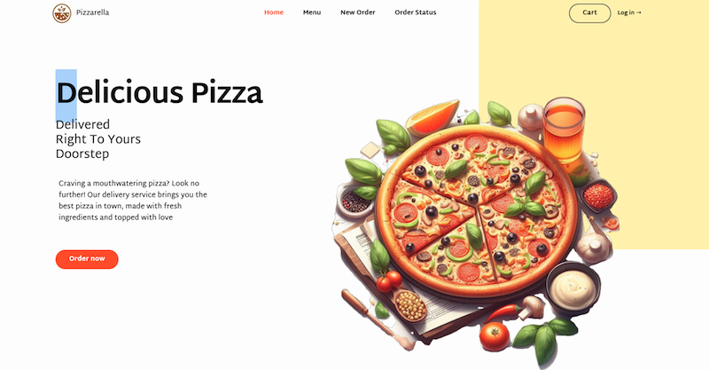
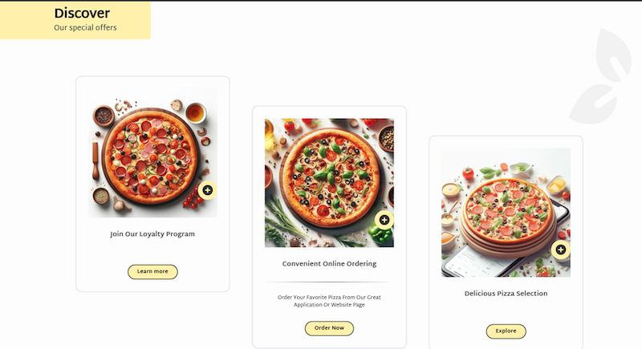
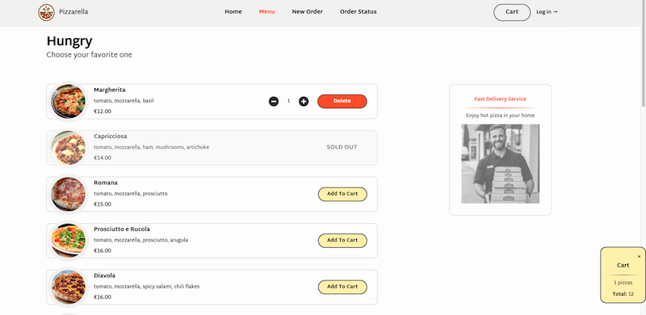

# PIZZARELLA


**Pizzarella** React Application with React Router, Tailwind CSS and Redux. Menu load from an API. State is manage with Redux Toolkit. I use Redux Thunks, useFetcher, loaders and actions

[https://pizzarella.netlify.app/](https://pizzarella.netlify.app/)



### Features

- All cart and checkout functionalities,
- Menu load from an API,
- React Redux Toolkit for state management,
- Asynchronous operations handled using Redux Thunks.
- UseFetcher hook to handle API requests.
- styled with Tailwind,
- Loaders and actions for better handling of loading state



### Under the hood

Technologies being used under the hood:

#### Stack:

- React
- Redux
- Tailwind
- React Router 6
- Redux Thunks



#### Project setup

First, run the development server:

```bash
npm run dev
# or
yarn dev
```

Open [http://localhost:3000](http://localhost:3000) with your browser to see the result.

### Live view

just visit [[https://pizzarella.netlify.app/](https://pizzarella.netlify.app/)!

Made with [@gregsypek](https://twitter.com/@gregsypek) 2022
